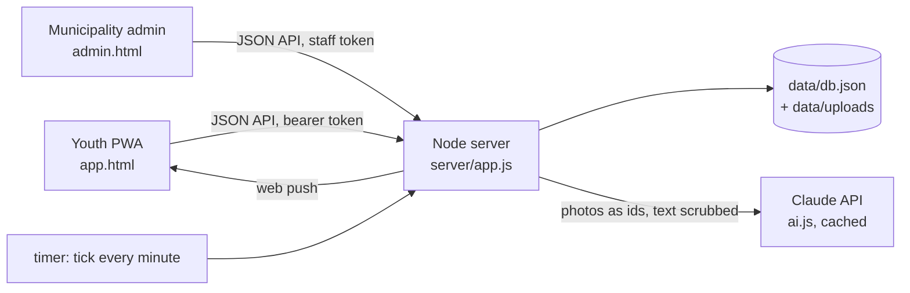

# Architecture

## Choices

- **Adapted from the existing repo** instead of the spec's React + Supabase stack, so it runs with no build step and no external database. The collections in `server/db.js` match the spec's tables one to one (`profiles` → `users`, `hotspots`, `actions` with embedded date options, `leader_applications`, `signups`, `attendance`, `data_cards`, `pickup_requests`, `news`, `notifications`, `point_events`, `certificates`, `rewards`, `redemptions`, `surveys`, `ai_cache`, `settings`…), so moving to Postgres/Supabase later is mechanical.
- **Everything that matters runs on the server**: points (idempotent per user, reason and reference), phases and certificates, verification thresholds, the action state machine, QR tokens and distance checks. The browser only sends requests.
- **Timers** (`logic.tick`, every minute): reporter offers expire after 24 h → public leader call; application windows close → AI ranking; 24 h after ranking → auto-confirm the top candidate; 24 h before a confirmed date → reminder.

## Action states

`leader_offered` (reporter first) → `leader_wanted` (applications) → `collecting` (leader sets dates, volunteers join) → `confirmed` (a date reached the threshold; leaders under 18 need an adult supervisor) → `in_progress` (safety checklist done) → `done` (AI or municipality verified the cleanup) or `under_review`.

## Hotspot states

`needs_confirmation` (dashed) → `ai_verified` / `verified` → `cleaned`, or `rejected`. Municipality hotspots start as `open`.

## Security and privacy

- Session tokens and login codes are stored only as SHA-256 hashes. Staff sign in with `ADMIN_TOKEN` (constant-time compare).
- Role checks on every route: youth, municipality, partner.
- Photos only from the in-app camera (source, GPS and a fresh timestamp are required), checked by the AI for faces, plates and documents **before** they're written to disk; otherwise nothing is stored.
- Free text passes a regex scrub and the AI privacy filter before it's stored or sent anywhere else.
- Rotating QR codes: an HMAC of action, kind and minute, valid for the current and previous minute.
- Security headers with a strict Content-Security-Policy; write rate limiting; JSON body size limits; path-traversal-safe static files.
- Users can export and delete all their data.
