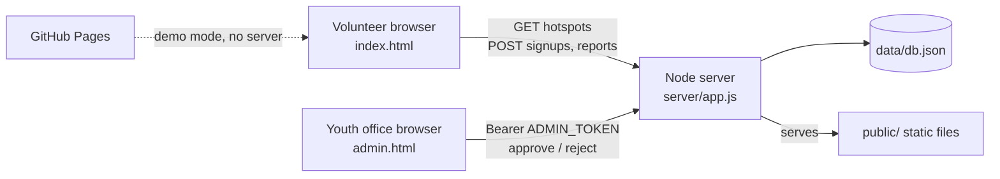

# Architecture

## Two modes, one front end

`public/js/api.js` calls `GET /api/health` on load:

- **Live:** the server answers, so every read and write goes to the API and is shared by all visitors.
- **Demo:** no server (for example on GitHub Pages). Hotspots come from `public/data/hotspots.json`; sign-ups and reports are kept in the visitor's `localStorage`, and no personal data is stored.

The rest of the front end only talks to the object `connect()` returns, so it doesn't care which mode it's in.

## Shared configuration

`public/js/config.js` holds the administrative units, map geometry, categories, urgency levels and age groups. The browser loads it as a module and the server imports the same file for validation, so the two can't drift apart.

## Server

- **No dependencies.** Node's `http`, `fs` and `crypto` only, so there is nothing to install and nothing to audit.
- **Routing** is a table of `[method, regex, handler]` in `server/app.js`.
- **Storage** (`server/store.js`) is a JSON file. Writes are queued so they never interleave, and each write goes to a temp file that is then renamed, so a crash can't leave a half-written database. This is fine for one server process during a hackathon; swap in SQLite or Postgres for production.
- **Validation** (`server/validate.js`) checks every field's type, length and allowed values before anything is stored.

## Security and privacy

- Public routes never return emails or cancel tokens. Cancelling a sign-up needs the random token returned only to the person who signed up.
- Admin routes need `ADMIN_TOKEN`, compared in constant time. With no token configured the dashboard is off.
- Security headers on every response: Content-Security-Policy (scripts only from this site and cdnjs), `X-Content-Type-Options`, `X-Frame-Options`, `Referrer-Policy`.
- Static file serving rejects paths outside `public/`.
- Write requests are rate limited per IP and bodies are capped at 10 KB.
- The front end escapes all user-provided text before inserting it into the page.
- Volunteers aged 15–17 must confirm a parent or guardian agrees before joining.

## The map

The map is a schematic SVG drawn with d3 on an 800 × 600 grid:
- the municipality outline is a hand-placed polygon,
- unit boundaries are Voronoi cells around each unit's centre, clipped to the outline,
- terrain contours come from a synthetic elevation field (mountains in the north-east and south-east, a valley along the Shkumbin).

It is deliberately not to scale. The roadmap replaces it with Leaflet, OpenStreetMap tiles and official boundaries.
